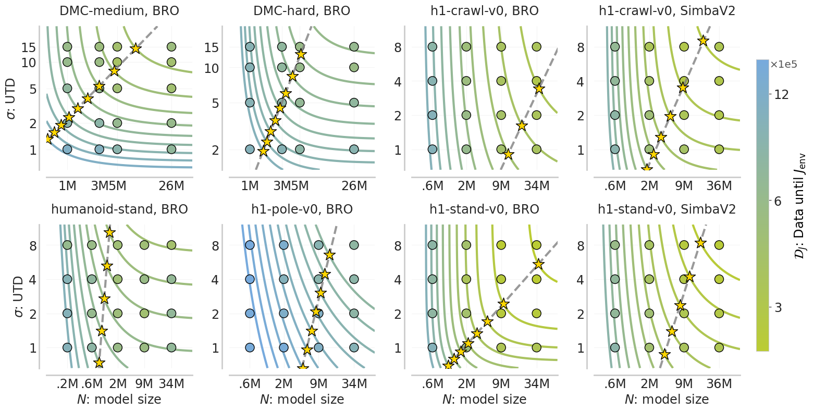

# Compute-Optimal Scaling for Value-Based Deep RL

### [[Paper](https://arxiv.org/abs/2508.14881)]  [[Website](https://value-scaling.github.io/)]

A workflow establishing predictability across updates-to-data (UTD) scaling
and model size scaling for RL, validated across multiple algorithms and environments. 
This predictability enables scaling laws.

Preston Fu*, Oleh Rybkin*, Zhiyuan Zhou, Michal Nauman, Pieter Abbeel, Sergey Levine, Aviral Kumar



## Setup

For running scaling law analysis in `scripts/`.

```bash
conda create -n value-scaling python=3.10
conda activate value-scaling
cd model_scaling
pip install -e .  # no dependencies, just sets up path
```

Install dependencies from **[our previous paper](https://arxiv.org/abs/2502.04327)**:
```bash
git clone https://github.com/prestonfu/qscaled.git
cd qscaled
pip install -e .
```

### [BRO](https://github.com/naumix/BiggerRegularizedOptimistic) training setup

The training scripts in `jaxrl/` are built on top of BRO.

```bash
# Follow SimbaV2 installation: https://github.com/dojeon-ai/SimbaV2
pip install -r https://raw.githubusercontent.com/dojeon-ai/SimbaV2/master/deps/requirements.txt

# Humanoid Bench
# ignore shimmy/gymnasium dependency error
git clone https://github.com/joonleesky/humanoid-bench
cd humanoid-bench
pip install -e .

# Jax for GPU
# ignore torch dependency error
pip install "jax[cuda12]==0.4.25" -f https://storage.googleapis.com/jax-releases/jax_cuda_releases.html --no-cache-dir

# or Jax for TPU
pip install "jax[tpu]==0.4.25" -f https://storage.googleapis.com/jax-releases/libtpu_releases.html

pip install -r requirements_bro.txt
```

**Jax debugging**

If you get cuDNN errors, you will need to install a different version. For our setup, the following installation works:
```bash
pip install nvidia-cudnn-cu12==8.9.2.26
```
You can verify your installation as follows:
```bash
python -c "import jax; print(jax.devices(), jax.numpy.sqrt(2))"
# Example output: [cuda(id=0)] 1.4142135
```

### BRO training script

We performed large sweeps by running many seeds in parallel on HumanoidBench
and Deepmind Control.

```bash
python train_parallel.py --benchmark=dmc --env_name=dog-run --num_seeds=5 --agent.updates_per_step=2
```


## Experimental results

### Analysis

The results for Section 5.1 are in `scripts/experiments/analysis/overfitting.ipynb`.
Those for Section 5.3 are in `scripts/experiments/analysis/passive_critic.ipynb`.

### Scaling laws

The main results are in `scripts/experiments/utd_x_width_x_bs/scaling_laws.ipynb`.

Additionally, we run full experiments on SimbaV2 (results in `scaling_laws_simba.ipynb`),
as well as a broader sweep across environments on Deepmind Control (results in
`scaling_laws_dmc.ipynb` and `scaling_laws_dog_humanoid.ipynb`.) These notebooks
export csvs, which are used as input for the main results.

### Reproduce notebooks

To run the notebooks, first download the data:
```bash
bash scripts/download_data.sh
```

## Citation
```bibtex
@misc{fu2025computeoptimal,
      title={Compute-Optimal Scaling for Value-Based Deep RL}, 
      author={Preston Fu and Oleh Rybkin and Zhiyuan Zhou and Michal Nauman and Pieter Abbeel and Sergey Levine and Aviral Kumar},
      year={2025},
      eprint={2508.14881},
      archivePrefix={arXiv},
      primaryClass={cs.LG},
      url={https://arxiv.org/abs/2508.14881}
}
```
